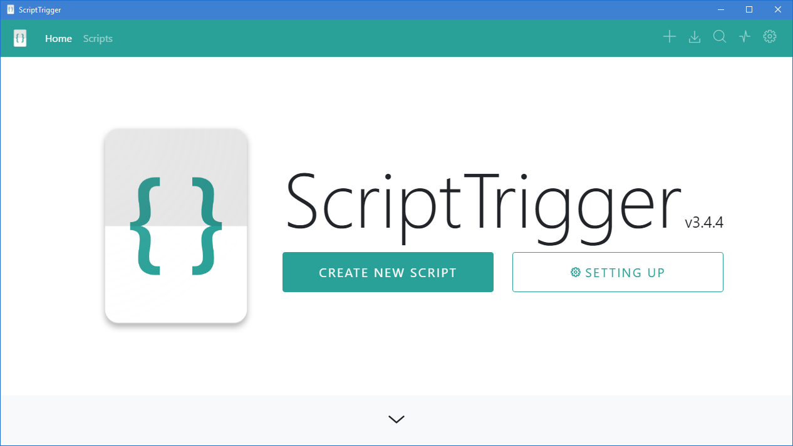
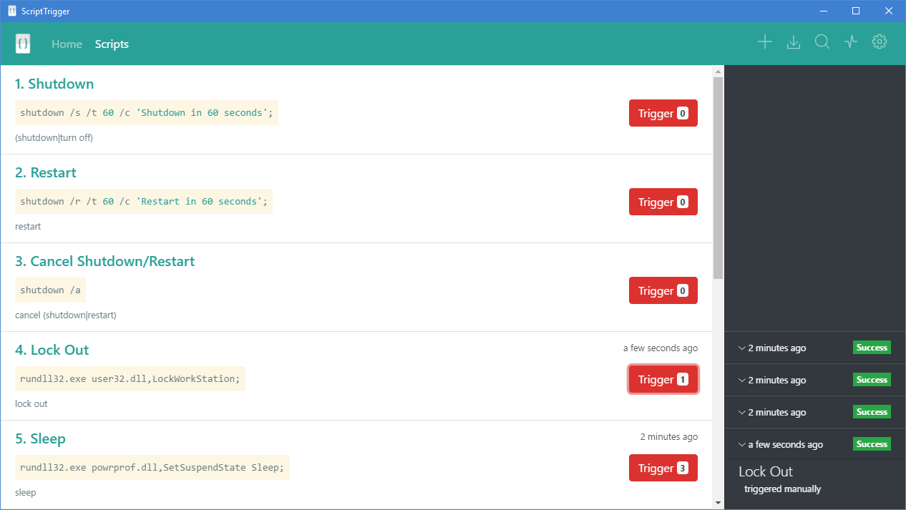

# **Script Trigger**

A service that allows you to control your PC through defined scripts. Scripts can be triggered manually or by voice activation (Alexa, Google Home...) via Pushbullet API.

# Prerequisites

* **Node** v8.4+ and **NPM** v5.4+
* **Repo** `git clone https://tnt1232007@bitbucket.org/tnt1232007/scripttrigger.git`

# Installing

```
# install npm packages
npm install

# start the server and run electron concurrently
npm start
```

# Publish

```
# install npm packages
npm install

# publish packages
npm publish
```

# Built With

* [Angular 5](https://angular.io/) - The Web framework
* [Angular CLI](https://cli.angular.io/) - Command line interface for Angular
* [Bootstrap 4](http://getbootstrap.com/) - An open source toolkit for developing with HTML, CSS, and JS
* [Electron](https://electronjs.org/) - Build cross platform desktop apps with JavaScript, HTML, and CSS
* [Electron Packager](https://github.com/electron-userland/electron-packager) - Bundles Electron-based application source code into packages ready for distribution.
* [HightlightJS](https://highlightjs.org/) - Syntax highlighting for the Web
* [Pushbullet API](https://docs.pushbullet.com/) - Send/receive pushes using the Pushbullet server

# Authors

* **TNT** - [tnt1232007](tnt1232007@gmail.com)

# Screenshots



